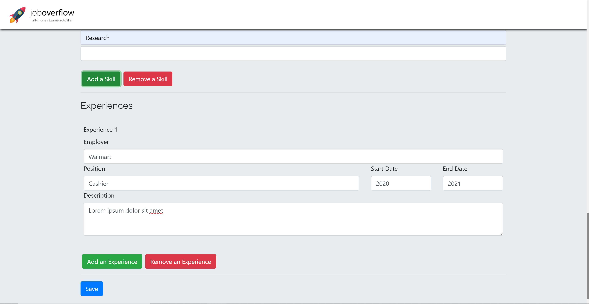

# JobOverflow

JobOverflow is a chrome extension created with React and Firebase Realtime Database to automate those pesky job forms. It involves users inputting information about themselves into a centralized form, which is synced to a database and used in conjunction with a web scraper to autofill job postings. Learn more about JobOverflow on [Devpost](https://devpost.com/software/joboverflow) and view a video demo of the project [here](https://www.youtube.com/watch?v=R6XqFKS6fOQ).

